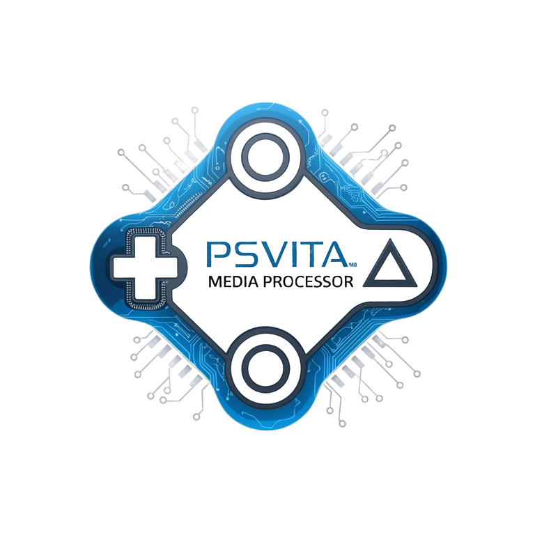

<p align="center">
  
</p>

<p align="center">
  <a href="https://www.python.org/"></a>
  <a href="LICENSE"></a>
</p>

---

## Features

* Multi-platform support: Mega.nz, YouTube, SoundCloud, and more
* Automatic media conversion for PS Vita compatibility
* Direct FTP transfer to your PS Vita
* Optimized output: video (960x544), audio (MP3 320kbps)
* Real-time download and conversion progress
* Optional automatic cleanup of temporary files


## Supported Sources

* **Mega.nz** – via `megatools`
* **YouTube** – via `yt-dlp`
* **SoundCloud** – audio-only support
* **Other websites** – generic support via `yt-dlp`

## Requirements

* Python 3.6 or later
* FFmpeg
* yt-dlp
* megatools
* PS Vita with VitaShell (FTP enabled)

## Installation

### 1. Clone the repository

```bash
git clone https://github.com/R0salman/PSVMP.git
cd PSVMP
```

### 2. Install Python dependencies

```bash
pip install tqdm yt-dlp
```

### 3. Install system dependencies

#### Windows

* [Download FFmpeg](https://ffmpeg.org/download.html)
* [Download megatools](https://megatools.megous.com/)
* Install yt-dlp:

  ```bash
  pip install yt-dlp
  ```

#### Linux (Ubuntu/Debian)

```bash
sudo apt update
sudo apt install ffmpeg megatools
pip install yt-dlp
```

#### macOS

```bash
brew install ffmpeg megatools
pip install yt-dlp
```

### 4. Verify installation

```bash
python psmedia.py --check-deps
```

## PS Vita Setup

1. Install VitaShell on your PS Vita
2. Launch VitaShell and press `SELECT` to start the FTP server
3. Note the **IP** and **Port** address shown on your PS Vita
4. Ensure your computer and PS Vita are connected to the same Wi-Fi network

## Usage

### Basic Examples

Download and convert a YouTube video:

```bash
python psmedia.py "https://www.youtube.com/watch?v=VIDEO_ID" --type video
```

Download and convert SoundCloud music:

```bash
python psmedia.py "https://soundcloud.com/artist/track" --type music
```

Download from Mega.nz with custom Vita IP:

```bash
python psmedia.py "https://mega.nz/file/..." --ip 192.168.1.100 --port 1337
```


## Command Line Options

```
positional arguments:
  url                   URL of the media file (Mega.nz, YouTube, SoundCloud, etc.)

optional arguments:
  -h, --help            Show this help message and exit
  --type {video,music}  Type of media to process (default: video)
  --ip IP               PS Vita IP address (default: 192.168.1.7)
  --port PORT           PS Vita FTP port (default: 1337)
  --check-deps          Check if required dependencies are installed
```

## 📺 Tutorial

Watch the full tutorial on how to use PSVMP:

<p align="center">
  <a href="https://www.youtube.com/watch?v=Ej24JAy4vIM">
    
  </a>
</p>

## Output Locations

* Videos: `ux0:/video/shows/` (MP4 format)
* Music: `ux0:/music/` (MP3 format)

## Technical Details

### Video Conversion

* Resolution: 960x544 (PS Vita native)
* Codec: H.264 Baseline Profile
* Bitrate: 1500k (max 2000k)
* Audio: AAC 128kbps, 44.1kHz

### Audio Conversion

* Format: MP3
* Bitrate: 320kbps
* Sample Rate: 44.1kHz

## Troubleshooting

### "Missing required tools" error

* Run `python psmedia.py --check-deps`
* Follow the installation instructions for any missing dependencies

### FTP connection failed

* Confirm that VitaShell FTP server is running (press `SELECT` in VitaShell)
* Check that your PS Vita and PC are on the same network
* Verify that the IP address and port are correct

### Download failed

* Retry the command (some sites rate-limit)
* For Mega links, confirm the link is still valid
* Check your internet connection

### Conversion failed

* Ensure the downloaded file is not corrupted
* Confirm FFmpeg is installed and on your system path
* Try using a different media source

## License

This project is licensed under the [MIT License](LICENSE).

## Acknowledgments

* Thanks to the VitaShell team for the FTP server functionality.  
* Thanks to the FFmpeg team for media processing.  
* Thanks to the yt-dlp developers for download handling.  
* Thanks to the megatools developers for Mega.nz support.  

---

<p align=center ><b>Made with ❤️ for the PS Vita community</b></p>
